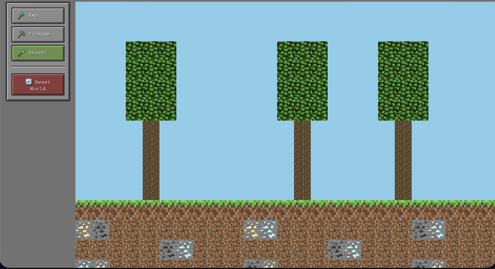

# Minecraft 2D

A 2D browser-based Minecraft-inspired game built with HTML, CSS, and JavaScript.

## Description

A 2D world made of tiles — grass, dirt, rock, and trees. The player selects a tool from the toolbar, mines tiles, collects them in an inventory, and places them back anywhere in the world. The world is procedurally generated with randomized tree positions on each load.

## How to Play

1. Select a tool from the toolbar (Axe, Pickaxe, or Shovel)
2. Click a matching tile to collect it
3. Collected tiles appear in your inventory
4. Click an inventory tile then click anywhere to place it back
5. Click **Reset World** to start fresh

## Tools

| Tool | Removes |
|------|---------|
| 🪓 Axe | Tree & Leaves |
| ⛏️ Pickaxe | Rock & Ore |
| 🪣 Shovel | Dirt & Grass |

## What I Found Hard

- Managing the placing vs mining state correctly
- Making the 2D grid align properly next to the sidebar
- Randomizing tree positions without overlap

## Known Bugs

- None currently known

## Tech Stack

- HTML5
- CSS3
- Vanilla JavaScript (no libraries)

## Live Demo

 https://minecraft-maronediton.netlify.app/
